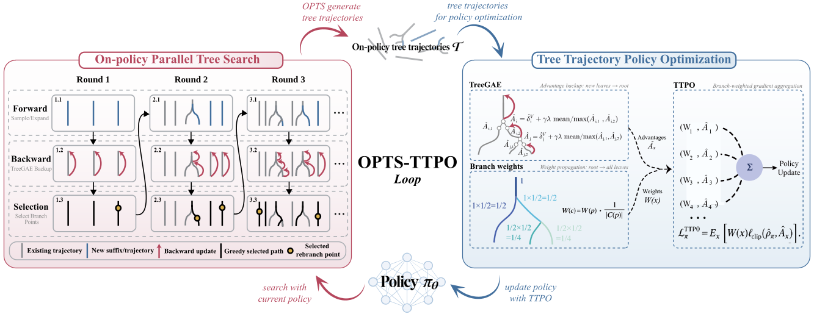

# OPTS-TTPO: Enhancing Finite-Sample Policy-Gradient Learning with Tree Search

<p align="center">
  <a href="#"><b>Paper</b></a> &nbsp;|&nbsp;
  <a href="#installation"><b>Installation</b></a> &nbsp;|&nbsp;
  <a href="#usage"><b>Usage</b></a> &nbsp;|&nbsp;
  <a href="#citation"><b>Citation</b></a>
</p>

<p align="center">
  <a href="assets/opts-ttpo-overview.pdf">
    
  </a>
</p>

<p align="center"><em>OPTS selects where to expand on-policy tree trajectories; TTPO learns from them using TreeGAE and branch-weighted policy updates.</em></p>

## News

- Coming soon.

## Introduction

This repository provides the official implementation of **OPTS-TTPO** for Atari, MuJoCo, and LLM post-training. Policy-gradient updates rely on finitely many trajectories and can miss rare, high-return continuations. Tree search can improve their coverage by reusing an observed prefix and spending additional rollout budget on fresh suffixes from selected states.

OPTS-TTPO connects **On-Policy Parallel Tree Search (OPTS)**, which allocates the rollout budget, with **Tree Trajectory Policy Optimization (TTPO)**, which learns from the resulting trees. The method must correct the multiplicity introduced by shared prefixes and account for the bias introduced when expansion states are selected from observed outcomes.

### On-Policy Tree Trajectories

An on-policy tree trajectory contains suffixes that share previously sampled prefixes. Every new action is sampled from the current policy, so attaching a suffix requires no action-distribution importance correction. However, selecting previously visited states for rebranching changes their sampling frequency relative to an ordinary policy chain.

### TTPO (Tree Trajectory Policy Optimization)

For a parent $p$ with children $c\in\mathcal C(p)$, TTPO uses normalized local weights $\alpha_{p,c}$ and propagates them through the tree:

$$
W(\text{root})=1,
\qquad
W(c)=W(p)\alpha_{p,c},
\qquad
\sum_{c\in\mathcal C(p)}\alpha_{p,c}=1.
$$

The **Branch Aggregation Lemma** states that, when branching decisions and weights are fixed from prefix information before outgoing transitions are sampled, branch-weighted tree statistics recover their on-policy chain expectations. Applying the lemma to the policy gradient gives the **Tree Trajectory Policy Gradient (TTPG)**:

$$
\nabla_\theta J(\theta)
=
\mathbb E_{\mathcal T}
\left[
\sum_{x\in\mathcal T}
W(x)\gamma^{d(x)}
A^{\pi_\theta}(s_x,a_x)
\nabla_\theta\log\pi_\theta(a_x\mid s_x)
\right].
$$

The weights prevent expanded suffixes from receiving extra influence solely because they appear more often in the tree. The recursive counterpart is **Tree-based Generalized Advantage Estimation (TreeGAE)**:

$$
\widehat A_x
=
\delta_x^V
+
\gamma\lambda
\sum_{c\in\mathcal C(x)}
\alpha_{x,c}\widehat A_c.
$$

Under the lemma's conditions, TreeGAE has the same conditional suffix expectation as chain GAE. TTPO applies $W(x)$ to the clipped PPO actor and value objectives, giving a practical PPO-style optimization method for tree trajectories.

### OPTS (On-Policy Parallel Tree Search)

OPTS selects rebranching states with a policy-relative **performance-difference estimate**:

$$
\widehat\Delta(s_t;\tau)
=
-\sum_{k=t}^{n-1}\gamma^{k-t}\widehat A_{x_k}.
$$

In deterministic environments with exact values, this is the difference between the current-policy value at $s_t$ and the observed suffix return. Atari and MuJoCo use the length-adjusted score $\widehat\Delta^{(\xi)}=\widehat\Delta/(n-t)^\xi$, while the LLM setting uses the unpenalized rollout-level score.

Each search round:

1. backs up TreeGAE from the new leaves to the roots;
2. follows the highest-advantage children to form a greedy path;
3. selects the state with the largest performance-difference score; and
4. samples and attaches new on-policy suffixes in parallel.

Under deterministic dynamics, exact current-policy values, and the conditions stated in the paper, max-backup OPTS improves the induced search policy monotonically as the search budget grows.

### Combining Search and Learning

The complete training loop alternates

$$
\pi_u \xrightarrow{\mathrm{OPTS}} \mathcal T_u
\xrightarrow{\mathrm{TTPO}} \pi_{u+1}.
$$

Because OPTS chooses expansion states after observing sampled outcomes, uniform branch weights correct multiplicity but do not remove adaptive selection bias. The paper decomposes this effect into posterior trajectory reweighting and, under max backup, an additional **prefix-credit** term.

In deterministic environments, max-backup TreeGAE propagates the best-minus-average suffix gap to preceding actions, allowing a discovered suffix to influence upstream learning before it is reliably reproduced. In stochastic environments, mean backup reduces selection of favorable environmental noise. The analysis bounds the resulting bias using the searched-tree fraction, expansion budget, branch weights, and suffix gaps.

## Installation

### Requirements

- OS: Ubuntu 22.04
- CUDA: >= 12.6
- Python: 3.10

### Download the Code

Download the main repository archive from its anonymous page and extract it into an `OPTS/` directory.

The project uses modified versions of VeRL and CleanRL maintained in separate repositories. Their source files are not included in the main repository snapshot. Download the corresponding source archives from these anonymous repositories:

| Dependency | Anonymous repository | Location in the main project |
| --- | --- | --- |
| VeRL (LLM experiments) | [Anonymous VeRL repository](https://anonymous.4open.science/r/verl/README.md) | `LLM/verl/` |
| CleanRL (Atari and MuJoCo experiments) | [Anonymous CleanRL repository](https://anonymous.4open.science/r/cleanrl/README.md) | `Atari_MuJoCo/cleanrl/` |

Extract each dependency archive into the directory listed above. If an archive contains an outer directory, place its contents directly at the target location, so that these paths exist:

```text
OPTS/LLM/verl/pyproject.toml
OPTS/LLM/verl/verl/
OPTS/Atari_MuJoCo/cleanrl/pyproject.toml
OPTS/Atari_MuJoCo/cleanrl/cleanrl/
```

The anonymous links are browser pages for viewing and downloading source code, not Git clone URLs. Once the sources are in place, continue with the installation instructions below, starting from the main project root.

### Atari & MuJoCo

**Hardware**: Multi-core CPU is sufficient.

```bash
cd Atari_MuJoCo/cleanrl
conda create -n cleanrl python==3.10
conda activate cleanrl
pip install uv
uv pip install .
uv pip install ".[atari]"
uv pip install ".[mujoco]"
```

### LLM

Local paths and service accounts are configured by the caller:

- `OPTS_CHECKPOINT_ROOT`: checkpoint base directory, defaulting to `LLM/checkpoints` when launched from `LLM/`. Keep the existing `opts_ttpo_<model-size>/<experiment>/global_step_<step>` layout. `CKPT_ROOT`, where supported, selects one model-size directory directly.
- `OPTS_FAST_CHECKPOINT_ROOT`: optional checkpoint base on a faster local mount.
- `WANDB_ENTITY`: explicit account or team for evaluation uploads and W&B queries. No account is supplied by the code. Historical source IDs come from `WANDB_SOURCE_PPO_RUN_ID`, `WANDB_SOURCE_DAPO_RUN_ID`, `WANDB_SOURCE_REINFORCE_RUN_ID`, `WANDB_SOURCE_OPTS_RUN_ID`, or `WANDB_SOURCE_REINFORCE_BASE_RUN_ID`; the diagnostic wrapper requires `WANDB_SOURCE_RUN=entity/project/run_id`.
- `OPTS_EXPECTED_HOST`: intended hostname for scripts with a host guard. Multi-node launchers use caller-provided `HEAD_IP` / `RAY_HEAD_ADDR` and `WORKER_IP`.
- `OPTS_SSH_TARGET` and optional `OPTS_SSH_PORT` (default `22`): remote target for the evaluation finalizers. `OPTS_NFS_SOURCE` supplies the `host:export` for optional NFS read mounts. The finalizer's legacy record lookup can be supplied as `OPTS_PENDING_STATUS`.

Activate the required Python environment before running scripts. Machine-specific paths and account values belong in local shell configuration, not tracked source files. The Hugging Face upload utility requires an explicit `--repo_id`.

**Hardware**: GPU requirements depend on the selected training script; check its GPU allocation before running.

> For more details, refer to the [VERL documentation](https://woniu9524.github.io/verl-doc/start/install.html).

```bash
conda create -n opts_verl python==3.10
conda activate opts_verl
```

**Install CUDA:**

```bash
wget https://developer.download.nvidia.com/compute/cuda/repos/ubuntu2204/x86_64/cuda-ubuntu2204.pin
mv cuda-ubuntu2204.pin /etc/apt/preferences.d/cuda-repository-pin-600

wget https://developer.download.nvidia.com/compute/cuda/12.8.0/local_installers/cuda-repo-ubuntu2204-12-8-local_12.8.0-570.86.10-1_amd64.deb
dpkg -i cuda-repo-ubuntu2204-12-8-local_12.8.0-570.86.10-1_amd64.deb
cp /var/cuda-repo-ubuntu2204-12-8-local/cuda-*-keyring.gpg /usr/share/keyrings/

apt-get update
apt-get -y install cuda-toolkit-12-8

update-alternatives --set cuda /usr/local/cuda-12.8

# Add CUDA to PATH permanently
echo 'export PATH=/usr/local/cuda-12.8/bin:$PATH' >> ~/.bashrc
echo 'export LD_LIBRARY_PATH=/usr/local/cuda-12.8/lib64:$LD_LIBRARY_PATH' >> ~/.bashrc
source ~/.bashrc
nvcc --version
```

**Install cuDNN:**

```bash
wget https://developer.download.nvidia.com/compute/cudnn/9.20.0/local_installers/cudnn-local-repo-ubuntu2204-9.20.0_1.0-1_amd64.deb
dpkg -i cudnn-local-repo-ubuntu2204-9.20.0_1.0-1_amd64.deb
cp /var/cudnn-local-repo-ubuntu2204-9.20.0/cudnn-*-keyring.gpg /usr/share/keyrings/

apt-get update
apt-get -y install cudnn
apt-get -y install cudnn9-cuda-12
```

**Install dependencies:**

```bash
cd LLM/verl
wget -nv https://github.com/Dao-AILab/flash-attention/releases/download/v2.8.3/flash_attn-2.8.3+cu12torch2.8cxx11abiFALSE-cp310-cp310-linux_x86_64.whl

USE_MEGATRON=0 bash scripts/install_vllm_sglang_mcore.sh
pip install math_verify
```

**Install NVIDIA Apex:**

```bash
git clone https://github.com/NVIDIA/apex.git
cd apex
# Set MAX_JOB according to the number of CPU cores on your machine (avoid setting it too high)
MAX_JOB=32 pip install -v --disable-pip-version-check --no-cache-dir --no-build-isolation --config-settings "--build-option=--cpp_ext" --config-settings "--build-option=--cuda_ext" ./
```

**Install VERL:**

```bash
cd LLM/verl
pip install --no-deps -e .
```

## Usage

### Atari & MuJoCo

**Run baselines:**

```bash
cd Atari_MuJoCo
bash scripts/run_ppo_atari_sticky.sh
bash scripts/run_ppo_continuous_action.sh
```

**Run OPTS-TTPO:**

```bash
cd Atari_MuJoCo
bash scripts/run_opts_ttpo_atari_bMean_sticky.sh
bash scripts/run_opts_ttpo_continuous_action_wEqual-bMax-nLen.sh
```

**Visualization:**

```bash
cd Atari_MuJoCo

# Plot Atari results
python visual/plot_atari.py /data/results/8_128 --output visual/all_tasks_atari.pdf

# Plot MuJoCo results
python visual/plot_mujoco.py /data/results/1_2048 --output visual/all_tasks_mujoco.pdf
```

### LLM

**Download models:**

```bash
cd LLM
hf download Qwen/Qwen3-1.7B --local-dir models/Qwen3-1.7B
hf download Qwen/Qwen3-1.7B-Base --local-dir models/Qwen3-1.7B-Base
```

**Run baselines:**

```bash
cd LLM
bash scripts/run_ppo.sh
bash scripts/run_dapo.sh
bash scripts/run_reinforce_pp_baseline.sh
```

**Run OPTS-TTPO (train-time searching):**

```bash
cd LLM
bash scripts/run_opts_ttpo.sh
```

> Entry point: `LLM/trainer/main_opts_ttpo.py`

**Run OPTS (test-time searching):**

```bash
cd LLM
bash experiments/RQ2/run_generate.sh
```

> Entry point: `LLM/trainer/main_opts_generation.py`

## Data

Training and test data are not included in the anonymous repository. Prepare them using `LLM/data_preprocess/` and store the processed files under `LLM/data/`.

| Split | Dataset | Source |
|-------|---------|--------|
| Train | math12k | [hiyouga/math12k](https://huggingface.co/datasets/hiyouga/math12k) (split: train) |
| Train | NuminaMath-1.5-RL-Verifiable | [nlile/NuminaMath-1.5-RL-Verifiable](https://huggingface.co/datasets/nlile/NuminaMath-1.5-RL-Verifiable) (split: train) |
| Test | math12k | [hiyouga/math12k](https://huggingface.co/datasets/hiyouga/math12k) (split: test) |
| Test | MinervaMath | [math-ai/minervamath](https://huggingface.co/datasets/math-ai/minervamath) (split: test) |
| Test | AMC23 | [math-ai/amc23](https://huggingface.co/datasets/math-ai/amc23) (split: test) |
| Test | AIME24 | [math-ai/aime24](https://huggingface.co/datasets/math-ai/aime24) (split: test) |
| Test | AIME25 | [math-ai/aime25](https://huggingface.co/datasets/math-ai/aime25) (split: test) |
| Test | AIME26 | [math-ai/aime26](https://huggingface.co/datasets/math-ai/aime26) (split: test) |

### Input/Output Format

The LLM experiments use the following chat format:

```json
[
    {
        "role": "system",
        "content": "You are a math problem solver. For each problem, think through it step by step within <think> </think> tags, then provide your final answer using \\boxed{}.\n\nRequirements:\n- Show your complete reasoning process inside <think> tags.\n- Provide your final answer inside \\boxed{}.\n\nExample:\nUser: If 3x + 7 = 22, what is x?\nAssistant: <think>\n3x + 7 = 22\n3x = 22 - 7 = 15\nx = 15 / 3 = 5\n</think>\nThe answer is \\boxed{5}."
    },
    {
        "role": "user",
        "content": "<question>"
    },
    {
        "role": "assistant",
        "content": "<think>\n...\n</think>\n...\\boxed{<answer>}..."
    }
]
```

## Main Results

<!-- TODO: Add experimental results -->

Coming soon.

## Project Structure

```text
OPTS/
|-- Atari_MuJoCo/
|   |-- cleanrl/                         # CleanRL fork, maintained as an independent repository
|   |   `-- cleanrl/
|   |       |-- ppo_atari_sticky.py
|   |       |-- ppo_continuous_action.py
|   |       |-- rpo_continuous_action.py
|   |       |-- opts_ttpo_atari_bMean_sticky.py
|   |       `-- opts_ttpo_continuous_action_wEqual-bMax-nLen.py
|   |-- scripts/
|   `-- visual/
|       |-- plot_atari.py
|       `-- plot_mujoco.py
|-- LLM/
|   |-- verl/                            # VERL fork, maintained as an independent repository
|   |-- trainer/
|   |   |-- opts_ttpo/
|   |   |   |-- ray_trainer.py
|   |   |   `-- core_algos.py
|   |   |-- main_opts_ttpo.py
|   |   |-- main_opts_generation.py
|   |   `-- main_eval.py
|   |-- utils/
|   |   `-- reward_fn.py
|   |-- data_preprocess/
|   |-- data/
|   |-- scripts/
|   `-- models/
`-- README.md
```

## Citation

<!-- TODO: Add citation -->

Coming soon.

## License

This project is licensed under the [Apache License 2.0](LICENSE).

## Acknowledgements

This project builds upon the following open-source frameworks:

- **Atari & MuJoCo**: [CleanRL](https://github.com/vwxyzjn/cleanrl) - A clean and simple implementation of RL algorithms.
- **LLM**: [VERL](https://github.com/verl-project/verl) - A flexible and efficient RL training framework for LLMs.

## Maintenance Notes

- `OPTS`, `LLM/verl`, and `Atari_MuJoCo/cleanrl` are maintained as three separate Git repositories.
- Commit code changes inside the repository that owns the files you changed.
- Do not run `git submodule update --init --recursive`; this project no longer uses submodules.
