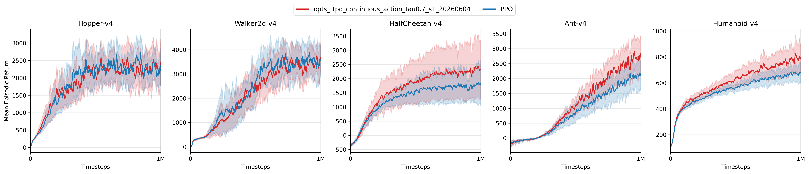

## 4 实验

本节从三个角度评估 OPTS-TTPO。首先，我们给出 LLM 可验证推理实验的设置与结果概览，说明训练时搜索在语言任务上的实例化方式。其次，我们在 Atari-57 与 MuJoCo 上做跨域验证，检验同策略树搜索是否能在标准强化学习控制任务中带来稳定收益。最后，我们在 MuJoCo 上直接测量策略梯度估计误差，分析 OPTS-TTPO 的改进是否来自更低噪声的梯度样本。除特别说明外，所有比较均采用 matched-budget 设置：Atari 与 MuJoCo 以环境交互步数计预算，LLM 以完整回答计预算。

### 4.1 LLM 训练时搜索

#### 4.1.1 设定

我们在 VeRL/Ray 框架上训练 `Qwen3-1.7B`，任务为可验证数学推理。训练集由 `math12k` 与 `NuminaMath-1.5-RL-Verifiable` 的竞赛子集构成，测试集包括 `math12k` test (`MATH500`)、`minervamath`、`amc23` 与 `aime25`。最大响应长度设为 `2048`，最大 prompt 长度设为 `1024`，合并 batch 大小约为 `2048`。由于 LLM 侧预算按完整 episode 计量，OTRC 在训练时采用不带长度惩罚的开发项（即 $\tau=0$），并仅允许在 `</think>` 之前继续分支，以保证搜索主要作用于推理阶段。

#### 4.1.2 训练后重复采样评测

本轮 LLM 结果以 step 300 checkpoint 的 i.i.d. 重复采样评测为准。每个问题采样 `128` 个回答，并在 `k=32` 的预算下计算 `avg@32`、`pass@32` 与 `cons@32`；表 1 按测试集与测试指标报告各方法分数。需要强调的是，该表评估的是训练时搜索之后得到的模型，而不是测试时搜索过程本身。由于 step 300 仍处于训练中期，且验证集 `mean@1` 曲线显示 OPTS-TTPO 的收益更可能在训练后期显现，表 1 应被视为当前 checkpoint 的保守快照，而非最终收敛性能比较。

**表 1：LLM 训练后重复采样评测。** 数值为百分比；加粗表示当前 checkpoint 中的最优值。

| 方法 | math12k avg@32 | math12k pass@32 | math12k cons@32 | minerva avg@32 | minerva pass@32 | minerva cons@32 | amc23 avg@32 | amc23 pass@32 | amc23 cons@32 | aime25 avg@32 | aime25 pass@32 | aime25 cons@32 |
| --- | ---: | ---: | ---: | ---: | ---: | ---: | ---: | ---: | ---: | ---: | ---: | ---: |
| REINFORCE++ | 59.54 | 81.80 | 69.40 | 16.51 | 29.78 | 19.85 | 39.06 | **87.50** | 60.00 | 10.52 | 36.67 | 20.00 |
| GPG | 68.12 | 80.80 | 76.80 | 21.19 | 35.29 | **22.79** | 52.58 | 80.00 | 72.50 | 14.90 | 33.33 | **30.00** |
| DAPO | 70.31 | 83.60 | 76.40 | **21.38** | 35.66 | 22.43 | **56.95** | 80.00 | 67.50 | 17.29 | 36.67 | 20.00 |
| PPO | **70.38** | 83.60 | **77.00** | 21.35 | 36.03 | 22.06 | 56.48 | 85.00 | **75.00** | **17.50** | 33.33 | **30.00** |
| OPTS-TTPO | 69.35 | **84.00** | 76.00 | 20.83 | **36.40** | 22.06 | 56.72 | 85.00 | 72.50 | 16.25 | **40.00** | 26.67 |

从 step 300 的单点结果看，不同指标的领先方法并不完全一致。OPTS-TTPO 在 `math12k`、`minervamath` 与 `aime25` 的 `pass@32` 上取得当前最优，说明该 checkpoint 已经能够覆盖更多正确解；但它在大多数 `avg@32` 和 `cons@32` 指标上尚未超过 PPO/DAPO，尤其在 `math12k` 与 `aime25` 的平均正确率上仍落后于 PPO。这一模式表明，OPTS-TTPO 在训练中期更明显地提升了候选解覆盖率，而平均样本质量与多数一致答案可靠性可能需要更充分的训练才能转化。结合验证集 `mean@1` 曲线，后续结果应优先报告更晚 checkpoint 或训练曲线，以检验这种后期优势是否稳定出现。

### 4.2 LLM 测试时搜索

除了训练时搜索，我们也将 OPTS 实例化为测试时搜索框架。在该设定下，总推理预算与 `pass@k` 或重复采样基线严格对齐；区别在于，OPTS 不把预算均匀分配给若干次完整重采样，而是根据节点质量将更多计算集中到更值得继续扩展的前缀上。具体而言，我们同时考虑 reward-guided 与 value-guided 两种指导模式，并使用 `avg@k`、`pass@k` 与 `cons@k` 作为核心指标。

与表 1 的单点重复采样评测不同，测试时搜索关注预算增长曲线。正式结果将以 $k\in\{8,16,32,64,128\}$ 为横轴，分别展示 `avg@k`、`pass@k` 与 `cons@k` 随推理预算增加的变化趋势。这样的展示方式可以区分两类现象：一类是模型本身经过训练后产生更高质量样本，另一类是测试时搜索在相同样本预算下更有效地分配计算。本文将在该组 scaling 曲线完成后再给出测试时搜索的结论性比较。

### 4.3 跨域验证：Atari 与 MuJoCo

为了检验 OPTS-TTPO 是否只适用于语言推理，我们进一步在 Atari-57 离散控制与五个 MuJoCo 连续控制任务上与 PPO 比较。Atari 提供高维视觉输入和离散动作空间，能够测试树搜索在复杂观测下的稳定性；MuJoCo 则提供低维连续控制和可恢复模拟状态，更适合观察重分支 rollout 是否能转化为更有效的策略更新。

#### 4.3.1 Atari-57

Atari 实验采用 CleanRL 风格的 PPO CNN actor-critic。每个任务训练 `10M` 环境步，使用 `8` 个并行环境与 `128` 步 rollout；OPTS-TTPO 使用相同环境交互预算，并在 action-level budget 下采用长度惩罚版本的 OTRC。主文不放置 57 个任务的完整曲线；完整可视化见附录 C。

由于 Atari 分数尺度跨任务差异很大，我们在主文中采用任务级胜场统计。对每个游戏，先在相同算法、相同任务下跨 `3` 个随机种子按日志步对齐平均，再计算两个标量：全训练期所有 `mean_return` 日志点的平均值，以及最后 `100` 条日志点的平均值。表 2 报告 PPO 与 OPTS-TTPO 在同时具有两侧结果的 57 个任务上的胜场数。OPTS-TTPO 采用 $\tau=0.7$、`s=4` 的运行。

**表 2：Atari-57 任务级胜场统计。** 每个任务只记一场胜负；分数高者记为该指标的胜者。

| 指标 | PPO 胜场 | OPTS-TTPO 胜场 |
| --- | ---: | ---: |
| 全训练期平均回报 | 26 | **31** |
| 最后 100 条日志平均回报 | 24 | **33** |

Atari 结果说明，OPTS-TTPO 的收益并不依赖 MuJoCo 中易于恢复的低维状态。在 57 个游戏上，OPTS-TTPO 在全训练期平均与尾部平均两个指标上都取得更多胜场，表明重分支预算在较多任务中转化为更好的样本效率或训练后期性能。同时，这一结果也应以任务级分布来理解：Atari 中仍存在 PPO 更强的游戏，说明 OTRC 的重分支偏好并非对所有奖励结构都同等有效。我们因此将 Atari 作为广覆盖的稳定性证据，而不将其解读为逐任务单调改进。

#### 4.3.2 MuJoCo

MuJoCo 实验覆盖 `Hopper-v4`、`Walker2d-v4`、`HalfCheetah-v4`、`Ant-v4` 和 `Humanoid-v4`。两种算法均训练约 `3M` 环境步，并使用相同的 rollout/update 预算。图 1 给出跨 `5` 个随机种子的学习曲线，阴影表示种子间波动。表 3 进一步报告训练末期表现，即最后 `100` 条日志点 `mean_return` 的跨种子平均。

**图 1：** MuJoCo 上 OPTS-TTPO 与 PPO 的学习曲线比较。

**表 3：MuJoCo 末期平均回报。** 每个数值为最后 `100` 条日志点的 `mean_return`，再跨 `5` 个随机种子平均。

| 任务 | PPO | OPTS-TTPO | 差值 |
| --- | ---: | ---: | ---: |
| `Hopper-v4` | 2004.0 | **2417.0** | +413.0 |
| `Walker2d-v4` | **3799.8** | 3554.9 | -244.9 |
| `HalfCheetah-v4` | 1959.0 | **3382.1** | +1423.1 |
| `Ant-v4` | **3986.7** | 3246.4 | -740.3 |
| `Humanoid-v4` | 871.2 | **1004.8** | +133.7 |

MuJoCo 呈现出比 Atari 更容易解释的任务级模式。OPTS-TTPO 在 `HalfCheetah-v4` 上取得最大提升，末期回报约为 PPO 的 `1.73` 倍；在 `Hopper-v4` 和 `Humanoid-v4` 上也有稳定增益。相反，`Ant-v4` 和 `Walker2d-v4` 的末期表现更偏向 PPO，说明重分支并不总能改善最终策略质量。结合学习曲线可以看到，OPTS-TTPO 的优势通常出现在能够从局部后缀再探索中快速获得可用行为改进的任务上；而在对长期姿态稳定性更敏感的任务中，搜索引入的样本选择偏差可能抵消方差收益。

总体上，Atari 与 MuJoCo 的结果支持一个较审慎的结论：OPTS-TTPO 能够在多种非语言控制任务上工作，并在相当一部分任务中优于 matched-budget PPO；但其收益具有任务依赖性。因此，本文不把树搜索视作对 PPO 的无条件替代，而是将其定位为一种可在同策略样本测度下重新分配 rollout 预算的策略梯度增强机制。

### 4.4 MuJoCo 上的梯度方差诊断

为了进一步回答“OPTS-TTPO 改善了什么”，我们在 MuJoCo checkpoint 上直接测量策略梯度估计误差
$$
\mathbb{E}\!\left[\|\hat g_B-g^\star\|_2^2\right],
$$
其中 $\hat g_B$ 表示由 batch size 为 $B$ 的样本估计得到的 actor 梯度，$g^\star$ 表示由大样本池近似得到的参考梯度。所有诊断均使用相同 checkpoint，只改变用于估计梯度的样本集合，从而尽量隔离策略本身差异对结果的影响。

#### 4.4.1 高优势样本具有更低梯度误差

第一组实验检验 OTRC 的核心动机：若搜索倾向于扩展高优势后缀，那么这些后缀是否确实提供更稳定的策略梯度信号。具体做法是，收集 `1M` 步 PPO-style rollout，按 step-level GAE advantage 排序，取 top $\alpha$ 与 bottom $\alpha$ 的样本分别作为高优势与低优势集合；随后对每个 batch size 做 bootstrap，并计算其梯度与 $g^\star$ 的均方误差。当前结果文件中 $\alpha=0.2$，每个任务使用 `5` 个采样种子。

**表 4：低优势样本相对高优势样本的梯度误差倍数。** 数值为 `neg_variance / pos_variance`，先在 seed 与 batch size 上求平均；大于 `1` 表示高优势样本的梯度估计更接近 $g^\star$。

| 任务 | 误差倍数 |
| --- | ---: |
| `Ant-v4` | 3.29 |
| `HalfCheetah-v4` | 1.16 |
| `Hopper-v4` | 9.62 |
| `Humanoid-v4` | 1.53 |
| `Walker2d-v4` | 3.14 |

表 4 显示，在五个任务上，高优势样本的梯度误差均低于低优势样本；差距在 `Hopper-v4` 与 `Ant-v4` 上尤其明显。这一结果为 OTRC 的开发项提供了机制性支持：沿着高优势区域继续搜索不仅可能提高回报，也更可能产生低噪声的 actor 更新样本。

#### 4.4.2 OPTS 与 PPO 的 batch-size 缩放

第二组实验直接比较 matched batch size 下 PPO rollout 与 OPTS 树样本的梯度误差。PPO 使用标准 rollout 样本估计 $\hat g_B$；OPTS 使用树搜索样本，并施加与训练一致的 $1/W$ 分支校正权重。参考梯度 $g^\star$ 由 `1M` 步 PPO buffer 近似得到，方差估计使用 `100` 次 bootstrap。

**表 5：OPTS 相对 PPO 的梯度误差缩放。** 数值为 `PPO variance / OPTS variance`，先在可用 batch size 与 seed 上求平均；大于 `1` 表示 OPTS 的误差更低。

| 任务 | PPO/OPTS 误差比 | OPTS 更低的比较数 |
| --- | ---: | ---: |
| `Ant-v4` | 1.34 | 40 / 40 |
| `HalfCheetah-v4` | 2.30 | 35 / 35 |
| `Hopper-v4` | 1.26 | 33 / 40 |
| `Humanoid-v4` | 0.64 | 0 / 40 |
| `Walker2d-v4` | 0.94 | 13 / 37 |

该结果与主任务表现基本一致但并非完全重合。`Ant-v4`、`HalfCheetah-v4` 与 `Hopper-v4` 上，OPTS 在大多数或全部 batch-size/seed 组合中取得更低梯度误差；其中 `HalfCheetah-v4` 的误差比达到 `2.30`，与其回报提升相符。`Humanoid-v4` 和 `Walker2d-v4` 则没有表现出同样的方差优势，提示树搜索带来的收益还受到状态分布偏移、任务动力学以及分支位置选择的共同影响。换言之，OPTS-TTPO 的经验收益不能简单归因为“采样更多后缀”，而应理解为在部分任务上成功地把预算集中到了更低误差的样本区域。

### 4.5 小结

本节的跨域实验给出三点结论。第一，在 Atari-57 上，OPTS-TTPO 在任务级胜场统计中优于 PPO，说明同策略重分支可以扩展到高维视觉控制。第二，在 MuJoCo 上，OPTS-TTPO 在 `Hopper-v4`、`HalfCheetah-v4` 与 `Humanoid-v4` 上提升末期回报，但在 `Ant-v4` 与 `Walker2d-v4` 上仍落后于 PPO，表明该方法的收益具有任务依赖性。第三，方差诊断显示高优势样本确实具有更低策略梯度误差，且 OPTS 在部分任务上显著降低 matched-batch 梯度误差；这为 OPTS-TTPO 的有效性提供了机制解释，同时也指出未来需要进一步控制搜索引入的样本选择偏差。
