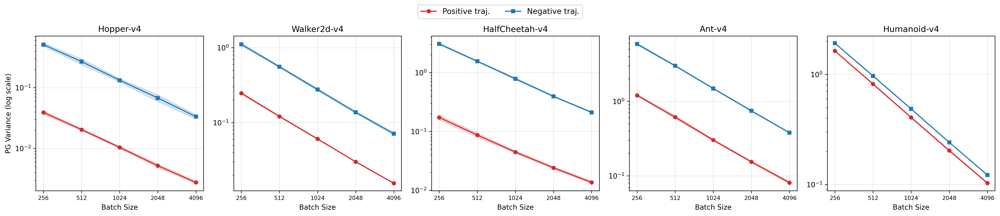
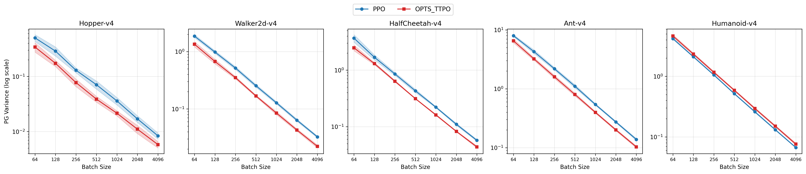

## 4 实验

本节评估 OPTS-TTPO 在可验证数学推理、离散控制和连续控制中的表现。除特别说明外，所有比较均采用 matched-budget 设置：LLM 以完整回答数计预算，Atari 与 MuJoCo 以环境交互步数计预算。实验设置汇总见附录 D 的表 A1。

### 4.1 LLM 训练时搜索

#### 4.1.1 实验设定

我们在 VeRL 框架上训练 `Qwen3-1.7B`，任务为可验证数学推理。训练集由 `math12k` 与 `NuminaMath-1.5-RL-Verifiable` 的竞赛子集构成，测试集包括 `math12k` test (`MATH500`)、`minervamath`、`amc23` 与 `aime25`。对比方法包括 PPO、DAPO、GPG、REINFORCE++ 和 OPTS-TTPO。

该实验检验训练时搜索是否在相同回答预算下带来更好的策略，并通过训练曲线区分稳定收益与偶然 checkpoint 差异。

#### 4.1.2 TODO：待补结果与目标

当前该组实验正在运行。最终版本将补充：验证集曲线（`avg@n`、`pass@n`、`cons@n`）、最终 checkpoint 的 `avg@32/pass@32/cons@32` 表格，以及 checkpoint 选择规则。目标是检验 OPTS-TTPO 是否在平均样本质量或正确解覆盖率上优于 PPO/DAPO。

### 4.2 LLM 测试时搜索

我们还将 OPTS 实例化为测试时搜索。在该设定下，总推理预算与重复采样基线对齐；OPTS 的区别在于根据前缀质量自适应分配 continuation 预算。

#### 4.2.1 TODO：待补结果与目标

当前该组实验正在运行。最终版本将报告 $k\in\{8,16,32,64,128\}$ 下的 `avg@k/pass@k/cons@k` 曲线，并与 i.i.d. sampling 和 self-consistency 做预算对齐比较。

### 4.3 跨域验证：Atari 与 MuJoCo

为检验 OPTS-TTPO 是否具有跨域适用性，我们在 Atari-57 离散控制和五个 MuJoCo 连续控制任务上与 PPO 进行 matched-budget 比较。这两类任务与 LLM 推理具有不同的观测形式、动作空间和预算单位，因此可以检验 OPTS-TTPO 是否只是语言任务中的特例，还是一种更一般的 rollout 预算重分配机制。

#### 4.3.1 Atari-57

Atari-57 分数尺度跨任务差异较大，因此主文采用任务级胜场统计；完整学习曲线见附录 C 的图 A1。

对每个游戏，我们跨 `3` 个随机种子对齐平均，并分别比较全训练期平均回报和最后 `100` 条日志的平均回报。表 1 报告 PPO 与 OPTS-TTPO 在 57 个任务上的胜场数。

**表 1：Atari-57 任务级胜场统计。** 每个任务只记一场胜负；分数高者记为该指标的胜者。

| 指标 | PPO | OPTS-TTPO |
| --- | --- | --- |
| 全训练期平均回报 | 26 | **31** |
| 最后 100 条日志平均回报 | 24 | **33** |

OPTS-TTPO 在两个统计口径下均取得更多胜场，说明同策略重分支能够扩展到高维视觉控制。全训练期平均回报的优势表明，搜索带来的重分支样本可以在较多任务中改善学习过程；尾部平均回报的优势则说明这种收益并非只出现在早期探索阶段。与此同时，仍有不少任务由 PPO 领先，表明 OTRC 的分支偏好并不适合所有奖励结构；因此 Atari 结果应被理解为跨任务总体收益，而不是逐任务单调改进。

#### 4.3.2 MuJoCo

MuJoCo 实验覆盖 `Hopper-v4`、`Walker2d-v4`、`HalfCheetah-v4`、`Ant-v4` 和 `Humanoid-v4`。图 1 给出最新学习曲线，红色为 OPTS-TTPO，蓝色为 PPO。

**图 1：** MuJoCo 上 OPTS-TTPO 与 PPO 的学习曲线比较。

图 1 显示，OPTS-TTPO 在 `HalfCheetah-v4` 和 `Humanoid-v4` 上明显高于 PPO，在 `Walker2d-v4` 上后期趋势更好；`Hopper-v4` 中两者接近，PPO 在尾部略占优势；`Ant-v4` 的跨种子波动较大，难以判断稳定优势。与 Atari 的任务级统计一致，MuJoCo 曲线表明重分支搜索可以提升部分连续控制任务的学习速度或最终回报，但其收益取决于任务动力学和分支位置选择。

### 4.4 策略梯度方差缩减实验

最后，我们通过方差缩减实验检验 OPTS-TTPO 的机制来源。该实验使用每个 MuJoCo 任务上由 PPO 训练 `1M` step 得到的固定 checkpoint，并以大规模 PPO rollout 估计参考 actor 梯度 $g^\star$。对给定 mini-batch，我们计算 $\|\hat g_B-g^\star\|_2^2$ 的 bootstrap 均值作为策略梯度方差代理；数值越低表示梯度估计越稳定。

#### 4.4.1 高优势样本具有更低方差

图 2 比较按 step-level GAE advantage 排序后得到的高优势样本与低优势样本。五个任务上，高优势样本在几乎所有 batch size 下都具有更低的策略梯度方差，支持 OTRC 将预算分配给高优势区域的设计动机。随着 batch size 增大，两类样本的方差均下降，但二者之间的稳定间隔表明，样本选择本身会影响梯度估计质量。

**图 2：** 高优势样本与低优势样本的策略梯度方差比较。

#### 4.4.2 OPTS-TTPO 降低 matched-batch 梯度方差

图 3 进一步在同一策略 checkpoint 下比较 PPO rollout 样本与 OPTS-TTPO 树样本在相同 batch size 下的方差缩放。OPTS-TTPO 样本使用与训练一致的 $1/W$ 逆概率加权，以校正重分支引入的采样测度变化。结果显示，OPTS-TTPO 在 `Hopper-v4`、`Walker2d-v4`、`HalfCheetah-v4` 和 `Ant-v4` 上整体低于 PPO，说明重分支搜索可以用相同 batch size 构造更稳定的梯度估计；`Humanoid-v4` 是主要例外，提示方差缩减还会受到任务动力学和分支位置选择影响。

**图 3：** PPO 与 OPTS-TTPO 在 matched batch size 下的策略梯度方差缩放。
