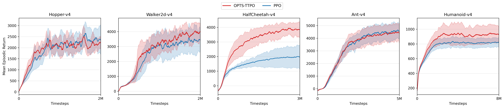

## 4 实验

我们从三个层面评估 OPTS-TTPO。首先，在 LLM 可验证推理任务上检验训练时搜索能否带来更强的策略优化效果；其次，在 Atari-57 与 MuJoCo 上做跨域验证，考察该方法是否具有超出 LLM 的一般性；最后，通过 MuJoCo 上的梯度误差诊断实验，直接分析 OPTS-TTPO 改善策略梯度估计的机制。除特别说明外，所有比较均在预算对齐的前提下进行：Atari 与 MuJoCo 以环境交互步数计预算，LLM 以完整回答计预算。

### 4.1 LLM 训练时搜索

#### 4.1.1 设定

我们在 VeRL/Ray 框架上训练 `Qwen3-1.7B`，任务为可验证数学推理。训练集由 `math12k` 与 `NuminaMath-1.5-RL-Verifiable` 的竞赛子集构成，测试集包括 `math12k` test (`MATH500`)、`minervamath`、`amc23` 与 `aime25`。最大响应长度设为 `2048`，最大 prompt 长度设为 `1024`，合并 batch 大小约为 `2048`。由于 LLM 侧预算按完整 episode 计量，OTRC 在训练时采用不带长度惩罚的开发项（即 $\tau=0$），并仅允许在 `</think>` 之前继续分支，以保证搜索主要作用于推理阶段。

#### 4.1.2 主结果

表 1 报告了训练完成后在四个测试集上的 `acc/mean@1`。

| 方法 | math12k | minervamath | amc23 | aime25 |
| --- | ---: | ---: | ---: | ---: |
| REINFORCE++ | 56.16 | 15.88 | 45.00 | 12.00 |
| GPG | 71.42 | 27.24 | 61.50 | 18.33 |
| PPO | 72.74 | 27.57 | 62.50 | 27.67 |
| DAPO | 73.00 | 29.34 | 65.25 | 24.33 |
| **OPTS-TTPO** | **73.92** | **30.77** | 54.00 | 18.00 |

**观察 1：** 在 `math12k` 与 `minervamath` 上，OPTS-TTPO 分别达到 `73.92` 与 `30.77`，同时超过 PPO、GPG、DAPO 与 REINFORCE++。这说明同策略树搜索可以在中等难度、可验证推理任务上改善训练信号质量：TTPO 的 branch-weight 修正避免了树内重复计数带来的偏移，而 TreeGAE 则使多个 continuation 的后缀信息能够被稳定汇总到同一更新目标中。

**观察 2：** 在 `amc23` 与 `aime25` 上，当前版本尚未超过 PPO 与 DAPO。这表明本文方法的收益并非在所有难度区间上都自动成立。一个更合理的解释是：当前 OTRC 更擅长在已有可行推理附近进行局部再探索，而在需要长程结构性跳跃的极难竞赛题上，搜索收益尚不足以覆盖额外方差与 credit assignment 难度。

### 4.2 LLM 测试时搜索

除了训练时搜索，我们也将 OPTS 实例化为测试时搜索框架。在该设定下，总推理预算与 `pass@k` 或重复采样基线严格对齐；区别在于，OPTS 不把预算均匀分配给若干次完整重采样，而是根据节点质量将更多计算集中到更值得继续扩展的前缀上。本文主要关注训练时搜索，因此这里只给出评估协议而不展开系统比较。具体而言，我们同时考虑 reward-guided 与 value-guided 两种指导模式，并使用 `avg@k`、`pass@k` 与 `cons@k` 作为核心指标。完整的测试时 scaling 结果将作为后续版本的重点补充。

### 4.3 跨域验证：Atari 与 MuJoCo

为了检验 OPTS-TTPO 是否具有跨域普适性，我们进一步在 Atari-57 离散控制与五个 MuJoCo 连续控制任务上与 PPO 做 matched-budget 比较。这两类任务分别覆盖高维视觉离散动作空间与低维连续动作空间，因此能够较全面地检验方法的泛化范围。

#### 4.3.1 Atari

Atari 实验采用 PPO 常见的 CNN actor-critic 设定，训练总步数为 `10M`，并使用 `8` 个并行环境和 `128` 步 rollout。对 OPTS-TTPO，我们采用与 PPO 相同的总体交互预算，并在 action-level 预算下对 OTRC 使用长度惩罚。由于 Atari-57 任务众多、任务间分数尺度差异显著，我们沿用 PPO 系列工作中常见的 aggregate reporting 方式，不直接在主文中堆叠全部任务曲线，而是先汇总“每个任务上哪种算法更强”的胜负统计。

**表 2：Atari-57 聚合比较。** 每一项统计的是在同时具有两种算法结果的任务上，哪一种算法取得更高得分。

| 比较指标 | PPO 胜场 | OPTS-TTPO 胜场 |
| --- | ---: | ---: |
| 全训练期平均回报 | 23 | **34** |
| 最后 100 次评估的平均回报 | **29** | 28 |

表 2 传达出两个相对稳定的事实。第一，OPTS-TTPO 在 Atari 上最突出的优势体现在**训练全过程的平均表现**：在 `57` 个可比任务中，它以 `34:23` 领先 PPO。这说明树搜索并非只是在极少数任务上产生偶然收益，而是在更广泛的任务集合上提高了整体样本效率。第二，若仅看训练末期的 tail performance，两者几乎打平（`28:29`）。这意味着 OPTS-TTPO 在 Atari 上的典型收益更接近于“更快学到较好的策略”，而不是“在所有任务上都把最终极限性能推到更高”。从算法机制上看，这一现象是合理的：OTRC 更擅长识别当前策略下值得继续扩展的局部后缀，因此首先改善的是中前期的数据利用效率；至于最终性能是否继续扩大优势，则更依赖具体游戏的延迟奖励结构与局部可重分支性。

#### 4.3.2 MuJoCo

MuJoCo 实验覆盖 `Hopper-v4`、`Walker2d-v4`、`HalfCheetah-v4`、`Ant-v4` 和 `Humanoid-v4` 五个连续控制任务。与 Atari 相比，MuJoCo 的状态可恢复性更直接、动作空间更低维，因此更适合观察“从旧状态继续 rollout”是否能够稳定转化为更高质量的策略梯度样本。

**图 1：** MuJoCo 上 OPTS-TTPO 与 PPO 的学习曲线比较。

图 1 显示，OPTS-TTPO 在 MuJoCo 上的收益比 Atari 更集中，也更稳定。`Walker2d-v4`、`HalfCheetah-v4` 与 `Humanoid-v4` 上，红色曲线在大部分训练区间都高于 PPO，其中 `HalfCheetah-v4` 的优势尤为显著，最终回报接近 PPO 的两倍。`Hopper-v4` 上，OPTS-TTPO 主要体现为更快的早期提升，而最终性能与 PPO 接近。`Ant-v4` 则是最接近的任务，两者在大部分区间内表现相当，PPO 在训练末期略占优势。

总体而言，MuJoCo 的结果呈现出比 Atari 更清晰的趋势：五个任务中有三个任务取得稳定且明显的提升，其余两个任务至少没有出现灾难性退化。这说明在连续控制中，OPTS-TTPO 所引入的树结构样本并非只是增加了 rollout 数量，而是更有效地把预算重新分配到了对梯度估计更有价值的后缀区域。换言之，MuJoCo 结果更直接地支持了本文的核心命题：**只要树搜索与 on-policy 梯度更新在样本测度上严格对齐，额外的后缀探索可以转化为实际的优化收益。**

### 4.4 MuJoCo 上的梯度方差诊断

为了进一步回答“OPTS-TTPO 改善了什么”，我们没有只停留在最终 return 曲线，而是直接考察策略梯度估计误差
$$
\mathbb{E}\!\left[\|\hat g_B-g^\star\|_2^2\right],
$$
其中 $\hat g_B$ 表示由 batch size 为 $B$ 的样本估计得到的 actor 梯度，$g^\star$ 表示由大样本池近似得到的参考梯度。所有诊断实验都在同一类 MuJoCo checkpoint 上进行，以避免策略本身差异干扰方差比较。

#### 4.4.1 高优势样本与低优势样本

第一组实验检验一个直接动机：如果搜索能够更集中地收集高优势片段，那么这些片段对应的策略梯度估计是否天然更稳定。具体做法是，先按 step-level GAE 优势对样本排序，再分别从高优势子集与低优势子集中做 bootstrap，比较二者的梯度估计误差。该实验的目的不是替代主任务结果，而是验证 OTRC 的开发方向是否与“降低梯度噪声”这一机制目标一致。

#### 4.4.2 PPO 与 OPTS 的 Batch-Size 缩放

第二组实验直接比较在 matched batch size 下，PPO 与 OPTS 的梯度估计误差如何随 $B$ 增大而衰减。对于 PPO，$\hat g_B$ 由标准 rollout 样本估计；对于 OPTS，则在同样的 batch size 下对树样本施加训练时一致的 $1/W$ 修正。若 OPTS-TTPO 的收益确实来自更高质量的梯度样本，那么在相同 $B$ 下，其 $\|\hat g_B-g^\star\|_2^2$ 应更小，或者在相同误差水平下需要更少的样本。这一诊断实验因此构成了主任务结果之外的重要机制证据。

### 4.5 小结

综合以上结果，可以得到三个结论。第一，训练时 OPTS-TTPO 在中等难度的 LLM 可验证推理任务上优于 PPO、GPG、DAPO 与 REINFORCE++，说明树搜索确实能够改善策略梯度训练信号。第二，在跨域验证中，Atari 的聚合统计表明 OPTS-TTPO 更具样本效率，而 MuJoCo 的学习曲线则显示其在多个连续控制任务上还能带来稳定的最终性能增益。第三，MuJoCo 上的梯度误差诊断为这一现象提供了机制解释：OPTS 的价值不只是“采更多 rollout”，而是通过对更有信息量的后缀区域进行再采样，在 matched budget 下构造出更有效的策略梯度估计。
