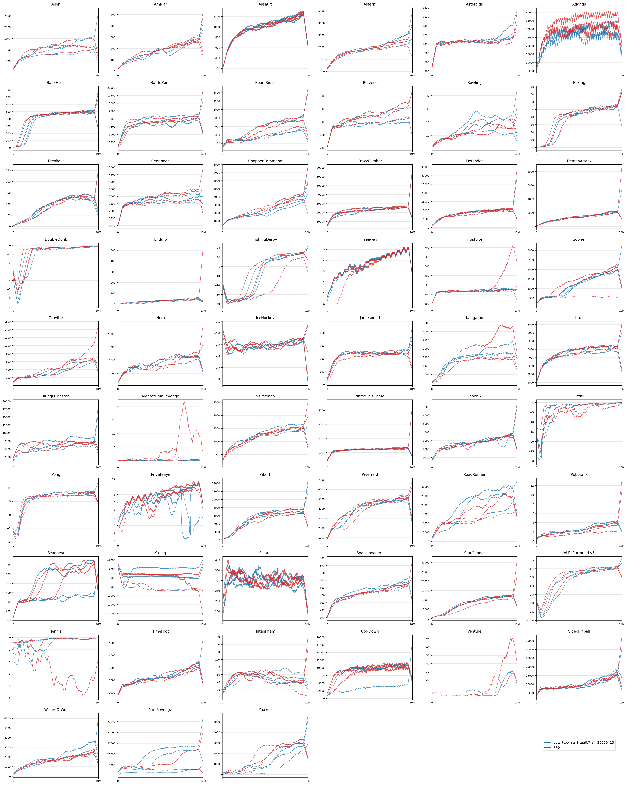

## 附录

### A. 分支校正的优势归一化

TTPO 的 actor、critic 与 advantage whitening 均使用由 $1/W(x)$ 定义的同一校正经验测度。给定 batch 中的树节点集合 $\mathcal{B}$ 与 TreeGAE 优势 $\hat A_x$，优势归一化采用
$$
\mu_A=\frac{\sum_{x\in\mathcal{B}}\hat A_x/W(x)}{\sum_{x\in\mathcal{B}}1/W(x)}, \qquad
\sigma_A^2=\frac{\sum_{x\in\mathcal{B}}(\hat A_x-\mu_A)^2/W(x)}{\sum_{x\in\mathcal{B}}1/W(x)}.
$$
标准化优势为
$$
\tilde A_x=\frac{\hat A_x-\mu_A}{\sqrt{\sigma_A^2+\varepsilon}}.
$$
若使用未校正的均匀均值与方差，高分支区域会因为样本数量更多而在 whitening 阶段被再次放大；上述加权归一化使 advantage whitening 与 TTPO actor/critic 目标保持在同一经验测度下。

### B. 跨域预算对齐与长度惩罚

OPTS 的重分支分数需要与具体任务的预算单位对齐。对于 LLM 推理，预算通常按完整 episode 或完整回答计量，因此主文中的开发项
$$
E_k=-\sum_{t=k}^{n-1}\gamma^{t-k}\hat A_{x_t}
$$
可直接使用，不额外加入长度惩罚。

对于 Atari 和 MuJoCo 这类 action-level budget 任务，更靠近根节点的位置的重分支会消耗更多环境交互步数。为使得不同位置的得分更接近“单位预算收益”，我们使用长度归一化的开发项
$$
E_k^{(\tau)}=
\frac{-\sum_{t=k}^{n-1}\gamma^{t-k}\hat A_{x_t}}{(n-k)^\tau},
\qquad \tau\ge 0.
$$
其中 $\tau=0$ 对应 episode-level budget，不进行长度惩罚；$\tau>0$ 则更偏向在相同 action budget 下收益更高的位置。本文在 LLM 实例中使用 $\tau=0$，在 Atari 与 MuJoCo 实例中使用 $\tau=0.7>0$ 的 action-level budget 版本。该项是对 OTRC 开发项的预算化延拓，而不是独立于 OTRC 的额外启发式目标。

### C. Atari-57 完整学习曲线

主文只报告 Atari-57 的任务级胜场统计，以避免在正文中放置过密的 57 任务曲线。图 A1 给出 PPO 与 OPTS-TTPO 在全部 Atari 任务上的完整可视化，便于检查收益与退化的任务分布。

**图 A1：** Atari-57 上 PPO 与 OPTS-TTPO 的完整学习曲线。
